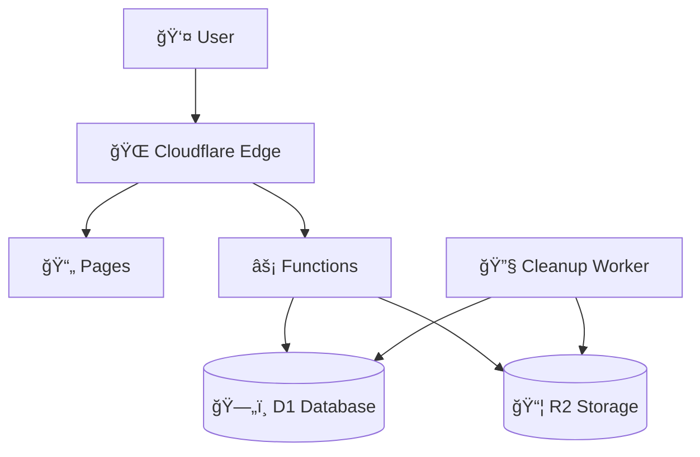

# TMC-File-Transfer

A secure, scalable file transfer solution built on Cloudflare's edge infrastructure. Features enterprise-grade security, rate limiting, and modern UI/UX.

## ✨ Features

- 🔒 **Secure File Uploads** - Comprehensive validation, encryption, and access controls
- ⚡ **Edge Performance** - Global CDN delivery via Cloudflare
- 🛡️ **Rate Limiting** - DDoS protection and abuse prevention
- 📱 **Mobile-First Design** - Responsive UI that works everywhere
- 🎯 **Smart Expiration** - Files automatically deleted after expiration
- 🔐 **Password Protection** - Optional password-protected downloads
- 📊 **Download Limits** - Configurable download count restrictions
- 🧹 **Auto Cleanup** - Scheduled worker removes expired files

## 🚀 Quick Start

### Prerequisites

- [Cloudflare Account](https://cloudflare.com) with Pages and Workers enabled
- [Node.js 18+](https://nodejs.org/) and npm
- [Wrangler CLI](https://developers.cloudflare.com/workers/wrangler/)

### 1. Clone and Install

```bash
git clone https://github.com/TheMarketingCompany/TMC-File-Transfer.git
cd TMC-File-Transfer
npm install
```

### 2. Setup Cloudflare Resources

```bash
# Install Wrangler CLI if not already installed
npm install -g wrangler

# Login to Cloudflare
wrangler login

# Create D1 database
wrangler d1 create tmc-file-transfer
# Copy the database_id from output

# Create R2 bucket
wrangler r2 bucket create tmc-transfers
```

### 3. Configure Environment

```bash
# Copy improved configuration
cp wrangler-improved.toml wrangler.toml

# Edit wrangler.toml and update:
# - database_id with your D1 database ID
# - bucket_name if you used different name
# - Your domain in ALLOWED_ORIGINS for production
```

### 4. Deploy

```bash
# Build the application
npm run build

# Deploy to Cloudflare Pages
npx wrangler pages deploy dist
# Note the deployment URL from output

# Run database migrations
curl -X POST https://your-deployment-url.pages.dev/api/db/migrate \
  -H "Authorization: Bearer your-secret-token"
```

### 5. Setup Cleanup Worker (Optional)

```bash
# Deploy cleanup worker
cd CleanupWorker
npm install
npx wrangler deploy

# Schedule the worker (in Cloudflare Dashboard):
# Go to Workers > Triggers > Add Cron Trigger
# Schedule: "0 */6 * * *" (every 6 hours)
```

## 🔧 Technologies Used

- **Frontend**: Vue 3, TypeScript, TailwindCSS
- **Backend**: Cloudflare Pages Functions
- **Database**: Cloudflare D1 (SQLite)
- **Storage**: Cloudflare R2 (S3-compatible)
- **CDN**: Cloudflare Edge Network
- **Security**: Web Crypto API, Rate Limiting

## 📖 Usage

### Uploading Files

1. **Select File**: Drag & drop or click to browse
2. **Configure Options**:
   - Set expiration (1 day, 1 week, 1 month)
   - Add password protection (optional)
   - Set download limits
3. **Upload**: Click upload and get shareable link
4. **Share**: Copy the generated secure link

### Downloading Files

1. **Access**: Use the shared link or enter file ID
2. **Authenticate**: Enter password if required
3. **Download**: File downloads immediately
4. **Auto-Cleanup**: Files expire automatically

## 🔒 Security Features

- **File Validation**: Only safe file types allowed
- **Rate Limiting**: Prevents abuse (10 uploads/hour per IP)
- **Password Protection**: SHA-256 hashed with unique salts
- **Secure Headers**: CSP, HSTS, XSS protection
- **Input Sanitization**: All inputs validated and sanitized
- **SQL Injection Prevention**: Prepared statements only
- **Auto Expiration**: Files automatically deleted

## ⚡ Performance Optimizations

- **Edge Caching**: Static assets cached globally
- **Database Optimization**: Indexed queries and batch operations
- **Lazy Loading**: Components loaded on demand
- **Compression**: Gzip/Brotli compression enabled
- **CDN Delivery**: Files served from nearest edge

## 🔧 Configuration

### Environment Variables (wrangler.toml)

```toml
[env.production.vars]
ENVIRONMENT = "production"
MAX_FILE_SIZE = "104857600"  # 100MB
ALLOWED_ORIGINS = "https://yourdomain.com"

[env.development.vars]
ENVIRONMENT = "development"
MAX_FILE_SIZE = "104857600"
ALLOWED_ORIGINS = "*"
```

### Rate Limiting (adjustable in `functions/_middleware.ts`)

```javascript
const RATE_LIMITS = {
  upload: { requests: 10, window: 3600 },    // 10 uploads/hour
  download: { requests: 100, window: 3600 }, // 100 downloads/hour
  validate: { requests: 50, window: 3600 }   // 50 validations/hour
};
```

### File Type Restrictions (adjustable in `src/utils/security.ts`)

```javascript
const ALLOWED_MIME_TYPES = new Set([
  'image/jpeg', 'image/png', 'application/pdf',
  // Add or remove types as needed
]);
```

## 📊 Monitoring & Analytics

### Built-in Metrics

- Upload/download counts
- Error rates and types
- Rate limiting effectiveness
- Storage usage
- Performance metrics

### Cloudflare Analytics

View detailed analytics in your Cloudflare dashboard:
- Workers Analytics
- Pages Analytics  
- R2 Usage Statistics
- D1 Query Performance

## 🛠 Development

### Local Development

```bash
# Start development server
npm run dev

# Run with local Cloudflare bindings
npx wrangler pages dev dist
```

### Build Commands

```bash
npm run dev        # Development server
npm run build      # Production build
npm run preview    # Preview build locally
```

### Database Management

```bash
# Run migrations
curl -X POST http://localhost:8788/api/db/migrate

# Query database locally
npx wrangler d1 execute tmc-file-transfer --command "SELECT * FROM uploads_v2 LIMIT 10"
```

## 🔍 Troubleshooting

### Common Issues

**"Database not found" error**:
- Ensure D1 database is created and ID is correct in wrangler.toml
- Run migrations: `POST /api/db/migrate`

**"R2 bucket not found" error**:
- Verify bucket exists: `wrangler r2 bucket list`
- Check bucket name in wrangler.toml

**Files not uploading**:
- Check file size (100MB limit)
- Verify file type is allowed
- Check rate limiting (10 uploads/hour per IP)

**Rate limiting too strict**:
- Adjust limits in `functions/_middleware.ts`
- Redeploy after changes

### Debug Mode

Enable debug logging by setting:
```javascript
console.log('Debug info:', debugData);
```

### Support

For technical issues:
1. Check the [troubleshooting guide](SECURITY.md)
2. Review Cloudflare Workers logs
3. Open an issue with detailed error information

## 📈 Scaling Considerations

### High Traffic

- **Rate Limiting**: Adjust limits based on usage patterns
- **Database**: D1 supports horizontal scaling
- **Storage**: R2 scales automatically
- **CDN**: Cloudflare edge handles traffic spikes

### Enterprise Use

- **Authentication**: Add OAuth integration
- **Audit Logging**: Implement comprehensive logging
- **Encryption**: Add client-side encryption
- **Compliance**: GDPR/SOC2 compliance features

## 🔄 Updates & Maintenance

### Regular Tasks

1. **Dependency Updates**: `npm audit && npm update`
2. **Security Patches**: Monitor for CVEs
3. **Cleanup Monitoring**: Verify expired files are deleted
4. **Performance Review**: Check analytics monthly

### Backup Strategy

- **Database**: D1 automatic backups
- **Files**: R2 versioning available
- **Configuration**: Version control (this repo)

## 🤝 Contributors

Special thanks to contributors:

- [Jona Schulz](https://github.com/schulzjona)
- [Maximilian Tschauder](https://github.com/derFrisson)  
- [TMC The Marketing Company GmbH & Co. KG](https://github.com/TheMarketingCompany)

### Contributing

1. Fork the repository
2. Create feature branch: `git checkout -b feature-name`
3. Commit changes: `git commit -am 'Add feature'`
4. Push to branch: `git push origin feature-name`
5. Create Pull Request

## 📄 Architecture



### Data Flow

1. **Upload**: File → Validation → R2 Storage → D1 Metadata
2. **Download**: Request → D1 Lookup → R2 Retrieval → User
3. **Cleanup**: Worker → D1 Query → R2 Deletion → D1 Update

## 📄 License

This project is licensed under the [GNU General Public License v3.0](https://www.gnu.org/licenses/gpl-3.0.en.html).

## 📞 Contact & Support

- **Issues**: [GitHub Issues](https://github.com/TheMarketingCompany/TMC-File-Transfer/issues)
- **Security**: See [SECURITY.md](SECURITY.md) for responsible disclosure
- **General**: Contact through [GitHub](https://github.com/TheMarketingCompany)

---

## 📚 Documentation

| Document | Description |
|----------|-------------|
| [DEPLOYMENT.md](DEPLOYMENT.md) | Step-by-step deployment guide |
| [CONFIGURATION.md](CONFIGURATION.md) | Complete configuration reference |
| [ENVIRONMENT.md](ENVIRONMENT.md) | Environment-specific setup |
| [SECURITY.md](SECURITY.md) | Security audit and features |
| [TROUBLESHOOTING.md](TROUBLESHOOTING.md) | Common issues and solutions |
| [CLAUDE.md](CLAUDE.md) | Technical architecture overview |

---

**Built with ❤️ using Cloudflare's edge platform**
